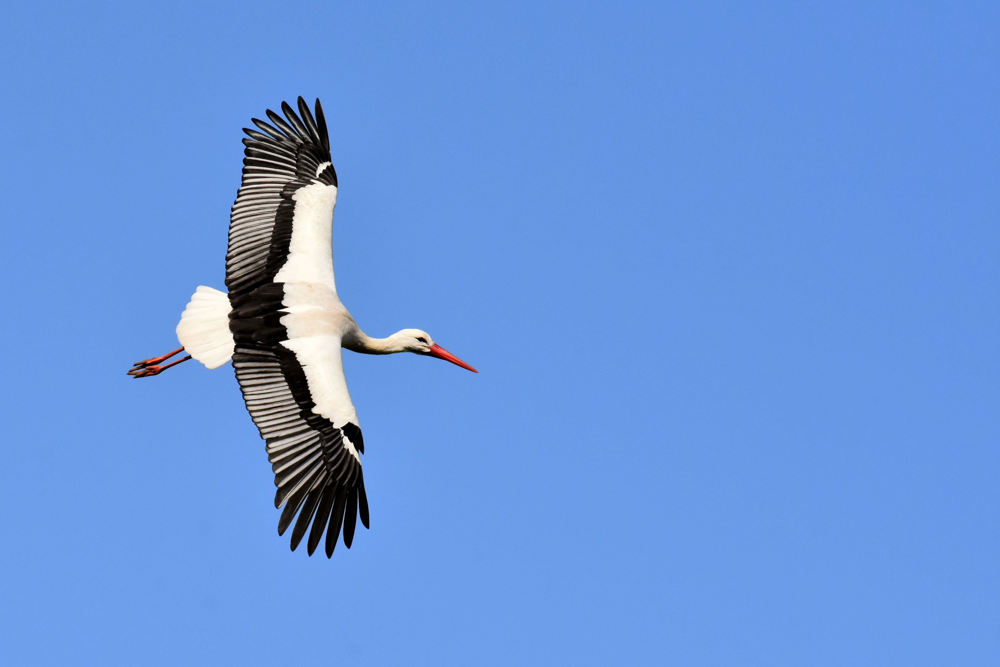

You may have heard that storks deliver babies. For some reason, the only photographs of storks in existence are always when they have an empty load either on the way to pick up a baby or after having delivered one. Most people have no idea why this is. People also wonder how they manage to deliver twins, triplets, and so on. Do they have a special carrier for multiple babies or does the dispatcher send multiple storks for multiple babies delivered to the same family? Below, I outline the reasons for this phenomenon.

## Amet mollit esse eu non.

Duis culpa reprehenderit ea cillum ex. Commodo velit veniam exercitation mollit aute Lorem velit sint consequat magna ullamco Lorem nisi nostrud.

* Consectetur
* Labore
* Veniam
* Dolore

**Ullamco** minim non sit quis quis elit aute. Eiusmod ex qui commodo reprehenderit. Tempor in laborum culpa proident reprehenderit velit esse laboris esse aliqua occaecat reprehenderit deserunt.Sunt est laboris aliqua irure aute. Enim nisi officia ex Lorem reprehenderit. Lorem eiusmod nostrud ipsum tempor quis consectetur labore labore eu occaecat ipsum irure magna consequat.

Cupidatat voluptate reprehenderit irure reprehenderit consequat. Aute nulla ad duis deserunt ipsum velit do velit dolor aliqua excepteur et. Ut officia elit incididunt id amet culpa. Ea laboris amet est non. Et proident excepteur irure deserunt. Labore id in velit in cillum ea aliqua consectetur laborum qui.
