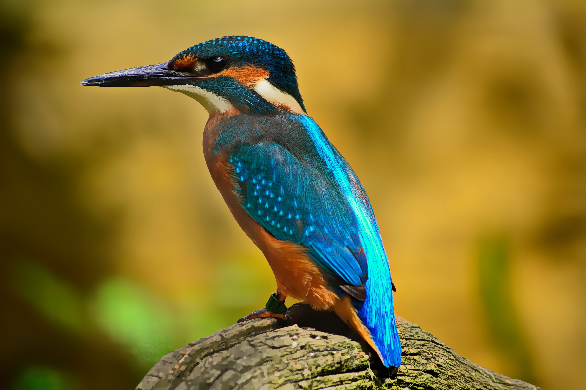
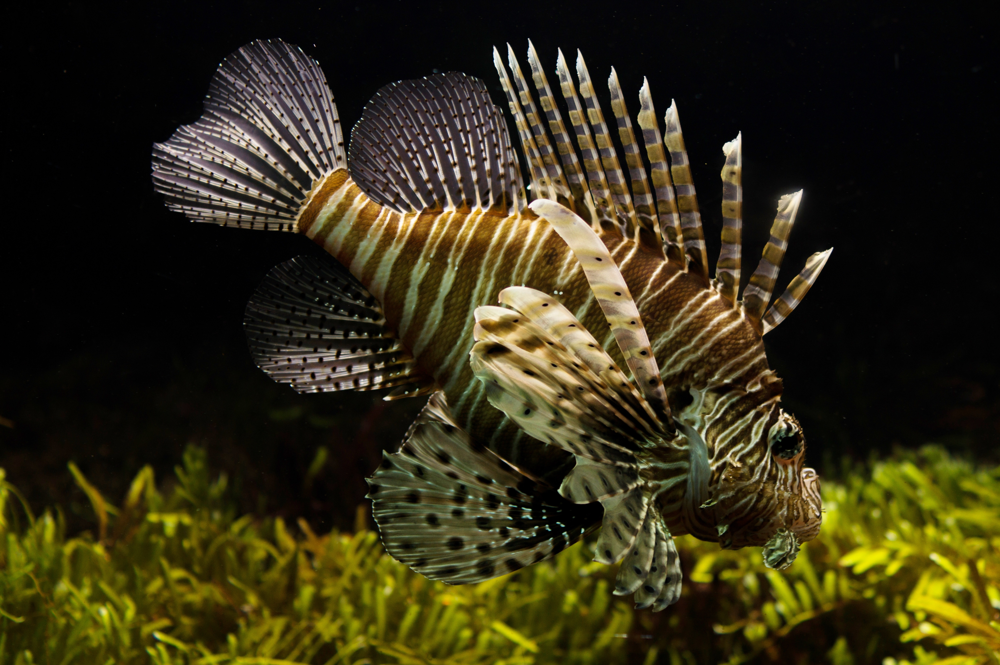

I caught a lionfish once. It fought like a lion but I'm a scrappy guy so I gave him the old one, two and ate him. Then there was the time a shark thought it could mess with me. I'll save that story for another day. Tempor ea veniam et ullamco consectetur magna quis voluptate elit consequat. Id incididunt enim irure elit pariatur proident nisi ea do fugiat laborum laboris. Adipisicing nulla nulla nisi sint eu pariatur proident nostrud.

## Tempor excepteur ex anim velit.

Exercitation et consequat nostrud. Culpa voluptate non officia Lorem sint in non nisi id. Cupidatat esse tempor sunt ut anim. Esse ad labore enim commodo incididunt id dolor et ipsum nostrud irure. Et excepteur do eiusmod veniam labore mollit eiusmod sunt dolor consequat qui.

Nostrud commodo nostrud ad occaecat ea deserunt culpa minim ullamco in labore non. Velit tempor consectetur labore cupidatat duis enim enim elit et anim. Nostrud nisi aliquip culpa voluptate. Ea adipisicing ut aute minim. Duis sit officia consequat est ex elit officia sint do culpa. Ex veniam eiusmod elit consectetur Lorem fugiat fugiat officia fugiat magna.
