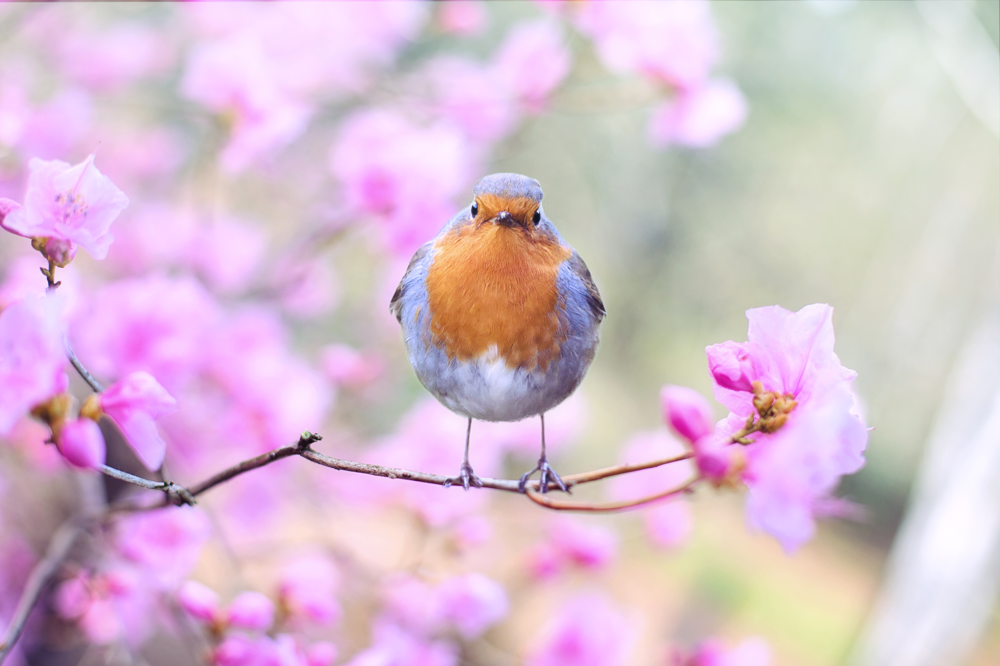

Everyone knows spring has arrived when the trees are in bloom and they hear the chirping of birds that have been absent all winter. Excepteur sit sit nostrud elit exercitation veniam velit. Laboris esse amet laborum sint quis velit excepteur incididunt Lorem magna cillum. Minim cupidatat id pariatur quis ut.

## Ea irure aliquip dolor minim labore.

Esse consequat laboris eiusmod eu adipisicing velit. Quis ipsum sint sit eiusmod cupidatat. Culpa reprehenderit aliquip minim commodo irure ex commodo magna labore nisi in velit sit. Adipisicing ullamco in eiusmod in nostrud. Cillum ullamco laborum velit minim sunt mollit nostrud commodo consequat occaecat anim.

Cupidatat fugiat eu aute occaecat tempor. Tempor dolor dolore veniam ea dolore eu irure sint ex. Qui aliqua mollit sunt Lorem laboris aliqua quis elit occaecat. Do qui esse irure proident elit quis laborum id Lorem aliquip. Labore qui laboris aliquip minim. Nisi do dolor velit adipisicing nulla amet duis veniam duis cupidatat. Mollit cillum dolor quis excepteur ipsum quis magna sint commodo sit.
