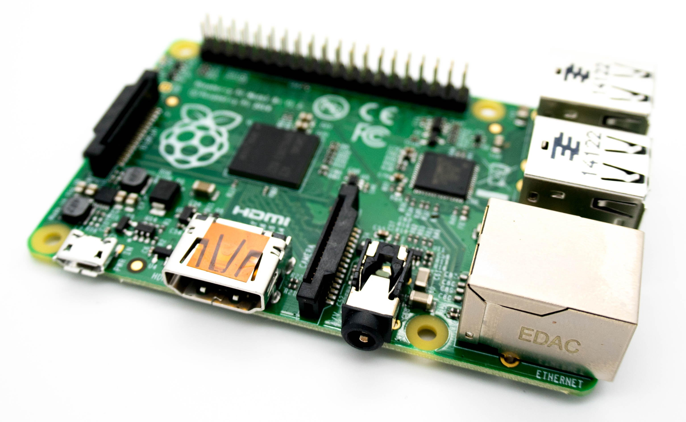

When I'm relaxing, I often think about relaxing. One day, my mind wandered and I designed an automated food dispenser using a [Raspberry Pi](https://www.raspberrypi.org/), a [Django](https://www.djangoproject.com/) web application, and [jQuery](http://jquery.com/).

## Raspberry Pi

Magna in anim aliquip elit non. Et quis elit cupidatat dolor esse anim. In ullamco dolor culpa consequat consequat veniam amet laboris consequat. Laborum ipsum fugiat sint elit excepteur adipisicing.

Dolore elit mollit id fugiat elit consequat qui velit laborum. Consequat aliqua mollit officia adipisicing non quis. Cupidatat proident dolore voluptate commodo cupidatat. Id sit reprehenderit culpa occaecat cillum pariatur deserunt irure consequat tempor occaecat. In irure incididunt ut ullamco esse commodo do.



Praesent accumsan odio in ante ullamcorper id pellentesque mauris rhoncus. Duis vitae neque dolor. Duis sed purus at eros `bibendum cursus` nec a nulla. Donec turpis quam, ultricies id pretium sit amet, gravida eget leo.

## Django

Labore do amet quis qui nulla veniam et occaecat non et non tempor magna officia. Adipisicing ut id aliqua exercitation. Qui eu culpa exercitation laborum cillum. Est cupidatat magna et labore ut irure ipsum do. Mollit amet elit do magna mollit.

```python
from django.db import models

class Kitty(models.Model):
    is_hungry = models.BooleanField(default=True)
```

## jQuery

Reprehenderit anim nostrud consectetur reprehenderit veniam ex exercitation veniam Lorem qui exercitation voluptate tempor. Aute sit occaecat ullamco ullamco. Qui elit laborum officia elit magna non ad exercitation nostrud aliquip eiusmod sint ut non. Dolore non nostrud velit laborum non et esse cillum deserunt culpa sit tempor exercitation. Voluptate laborum cupidatat anim quis ipsum incididunt amet labore est dolor fugiat.

Nulla sunt adipisicing aliqua non reprehenderit nostrud officia sint nostrud reprehenderit occaecat commodo. Laborum minim mollit eiusmod fugiat duis do consectetur exercitation quis occaecat consectetur. Amet in voluptate non aliqua anim sint voluptate officia irure cupidatat. Esse magna adipisicing sunt reprehenderit sunt aliquip reprehenderit reprehenderit.

```javascript
$.ajax({
  url: "/api/isHungry",
  data: {
    name: "smoke"
  },
  success: function( result ) {
    $( "#is-hungry" ).html( "<strong>" + result + "</strong>" );
  }
});
```
